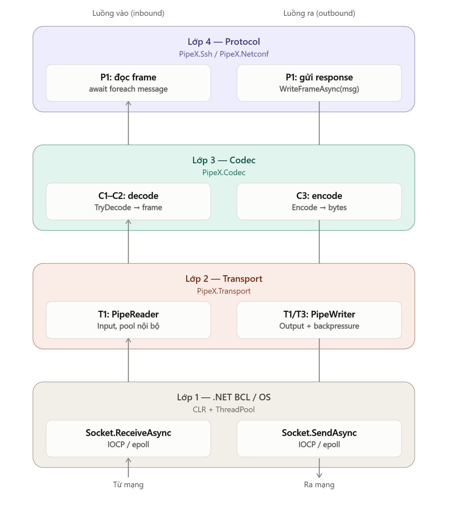

# PipeX — Thiết kế chi tiết từng module

# A. KIẾN TRÚC PHÂN LỚP

```
┌────────────────────────────────────────────────────────────────────┐
│  LỚP 4 — Protocol  (PipeX.Ssh, PipeX.Netconf — giai đoạn sau)      │
│  Chỉ nhìn thấy: IDuplexPipe, IAsyncEnumerable<TFrame>,             │
│                 IFrameDecoder<T>/IFrameEncoder<T>                  │
└───────────────────────────┬────────────────────────────────────────┘
                            │ await foreach (var f in reader.ReadFramesAsync(codec, ct))
                            │ await writer.WriteFrameAsync(codec, frame, ct)
┌───────────────────────────┴────────────────────────────────────────┐
│  LỚP 3 — PipeX.Codec                                               │
│  Chỉ nhìn thấy: PipeReader, PipeWriter, ReadOnlySequence<byte>,    │
│                 IBufferWriter<byte>, TimeProvider                  │
└───────────────────────────┬────────────────────────────────────────┘
                            │ IDuplexPipe.Input / IDuplexPipe.Output
┌───────────────────────────┴────────────────────────────────────────┐
│  LỚP 2 — PipeX.Transport                                           │
│  Chỉ nhìn thấy: Socket, System.IO.Pipelines.Pipe, PipeOptions      │
│  (tuỳ chọn: Microsoft.AspNetCore.Connections.Abstractions)         │
└───────────────────────────┬────────────────────────────────────────┘
                            │ Socket.AcceptAsync/ReceiveAsync/SendAsync,
                            │ System.Threading.Channels (nếu cần hàng đợi), TimeProvider
┌───────────────────────────┴────────────────────────────────────────┐
│  LỚP 1 — .NET BCL / CLR / OS  (ThreadPool + IOCP/epoll)            │
└────────────────────────────────────────────────────────────────────┘
```

**Nguyên tắc bất biến:** một module không bao giờ "nhìn xuyên" quá 1 tầng. Codec không bao giờ đụng trực tiếp `Socket`; Protocol không đụng trực tiếp `PipeReader`/`PipeWriter` thô mà chỉ thấy chuỗi frame đã decode. Mọi giao tiếp giữa Protocol và Codec đi qua `IDuplexPipe` + `IFrameDecoder<T>`/`IFrameEncoder<T>`.



---

# B. TRÁCH NHIỆM, INPUT/OUTPUT VÀ CHI TIẾT KIẾN TRÚC TỪNG LỚP

Mỗi module trả lời 5 câu hỏi: *Mục tiêu? Input? Output? Tương tác tầng trên? Tương tác tầng dưới?*

---

## LỚP 2 — PipeX.Transport

### T1. `IDuplexPipe` — cầu nối hai chiều với socket

**Mục tiêu:** là "handle" duy nhất mà Codec cầm để đọc/ghi byte, che giấu hoàn toàn `Socket` bên dưới

**Input:** `Socket` đã accept (server) hoặc đã connect (client).

**Output:**
```csharp
public interface IDuplexPipe
{
    PipeReader Input  { get; }   // đọc byte tới từ socket
    PipeWriter Output { get; }   // ghi byte đi ra socket
}
```
`Input`/`Output` là cặp `PipeReader`/`PipeWriter` lấy từ một `System.IO.Pipelines.Pipe` nội bộ (chiều đọc) và ghi thẳng ra `Socket` (chiều ghi) — hoặc dùng nguyên `ConnectionContext.Transport` nếu build trên `Microsoft.AspNetCore.Connections.Abstractions`.

**Tương tác với tầng trên:** `IFrameDecoder<T>`/`IFrameEncoder<T>` (Lớp 3) chỉ gọi `Input.ReadAsync()`/`Output.GetMemory()`/`Output.FlushAsync()` — không handler nào ở Codec/Protocol cầm `Socket` trực tiếp.

**Tương tác với tầng dưới:** `Socket.ReceiveAsync(Memory<byte>)` đổ dữ liệu vào `PipeWriter` nội bộ; `Socket.SendAsync(ReadOnlyMemory<byte>)` lấy dữ liệu từ `PipeReader` phía ghi.

**Sơ đồ — vị trí trong đường đọc/ghi:**
```
Socket.ReceiveAsync(dest) ──dest = PipeWriter.GetMemory()── ghi n byte thực nhận ── Advance(n) + FlushAsync()
                                                                                            │
                                                                       PipeReader.ReadAsync() → ReadOnlySequence<byte>
                                                                                            │  (đa đoạn, KHÔNG copy)
                                                                                    Codec.TryDecode(...)

Codec.Encode(...) → IBufferWriter<byte> (PipeWriter.Output) ── FlushAsync() ── Socket.SendAsync(bytes)
```

**Lựa chọn triển khai:**
- *Tối giản (zero-dependency):* tự viết `SocketDuplexPipe` ~50 dòng, dùng `System.IO.Pipelines.Pipe` cho chiều đọc và gọi thẳng `Socket.SendAsync` cho chiều ghi.
- *Production-ready (khuyến nghị):* implement `ConnectionContext` từ `Microsoft.AspNetCore.Connections.Abstractions` và tái dùng `Kestrel SocketTransport` — gói này chạy độc lập, không cần host ASP.NET Core, chính SignalR/YARP dùng theo cách này.

---

### T2. `PipeXListener` — vòng đời kết nối & accept loop

**Mục tiêu:** lắng nghe kết nối mới và giao mỗi kết nối cho đúng một `Task` xử lý độc lập — thay thế `ServerBootstrap` + `TcpServerSocketChannel` + `EventLoopGroup` của v0.1 bằng một accept-loop async đơn giản.

**Input:** `EndPoint` để bind, và `Func<IDuplexPipe, CancellationToken, Task> onConnected` do tầng Protocol cấu hình.

**Output:** với mỗi kết nối mới — một `Task` độc lập chạy `onConnected(pipe, ct)`; listener tự theo dõi tập `Task` đang chạy để có thể `DrainAsync()` khi shutdown.

```csharp
public sealed class PipeXListener(EndPoint endpoint,
                                   Func<IDuplexPipe, CancellationToken, Task> onConnected)
{
    public async Task RunAsync(CancellationToken ct)
    {
        using var listenSocket = new Socket(SocketType.Stream, ProtocolType.Tcp);
        listenSocket.Bind(endpoint);
        listenSocket.Listen();

        while (!ct.IsCancellationRequested)
        {
            var socket = await listenSocket.AcceptAsync(ct);
            _ = HandleAsync(socket, ct);           // 1 connection = 1 Task, không ghim thread
        }
    }

    private async Task HandleAsync(Socket socket, CancellationToken ct)
    {
        await using var pipe = new SocketDuplexPipe(socket, PipeXPipeOptions.Default);
        try { await onConnected(pipe, ct); }
        finally { socket.Shutdown(SocketShutdown.Both); }
    }
}
```

**Tương tác với tầng trên:** đây là entry point mà PipeX.Ssh/PipeX.Netconf gọi để khởi động server 

**Tương tác với tầng dưới:** `Socket.AcceptAsync(CancellationToken)` (API `ValueTask<Socket>` hiện đại của .NET) và `Socket.Bind/Listen`

**So với v0.1:** loại bỏ hoàn toàn việc gán `workerGroup.Next()` cho từng channel — mỗi `Task` được ThreadPool lên lịch động (work-stealing), không ghim cứng vào một trong N thread cố định.

---

### T3. Cấp phát bộ nhớ & Backpressure — cấu hình qua `PipeOptions`

**Mục tiêu:** Cấp phát vùng nhớ cho dữ liệu đọc/ghi mà không tạo rác cho GC (không `new byte[n]` mỗi lần nhận/gửi), và là điểm cấu hình duy nhất nếu sau này cần đổi chiến lược pool. Bảo vệ RAM khi peer đọc chậm (rất quan trọng với SSH/NETCONF chạy qua WAN chậm) — không cho phép business handler "bơm" dữ liệu vô hạn vào bộ nhớ khi socket chưa gửi kịp.

**Input:**
```csharp
public static class PipeXPipeOptions
{
    public static readonly PipeOptions Default = new(
        pool: MemoryPool<byte>.Shared,
        pauseWriterThreshold: 1 << 20,   // 1 MiB — tương đương "highWaterMark" của v0.1
        resumeWriterThreshold: 1 << 19); // 512 KiB — tương đương "lowWaterMark"
}
```

**Output:**
- Cấp phát: mọi `PipeWriter.GetMemory()` mượn từ `MemoryPool<byte>.Shared` (đã pool sẵn, không tạo rác GC) — không cần `IPipeXBufferAllocator` riêng.
- Backpressure: khi dữ liệu chưa-đọc vượt `pauseWriterThreshold`, `PipeWriter.FlushAsync()` trả về `Task` **chưa hoàn tất** cho tới khi consumer đọc bớt xuống dưới `resumeWriterThreshold` — writer tự "treo" mà không cần polling cờ `IsWritable`.

**Tương tác với tầng trên:** Codec gọi `await writer.FlushAsync(ct)` như bình thường; nếu peer đọc chậm, câu lệnh này tự chờ — Codec không cần biết gì về watermark.

**Tương tác với tầng dưới:** bọc thẳng `MemoryPool<byte>.Shared` (mặc định, thay được nếu cần chiến lược pool khác) — đây là API chuẩn BCL.

---

## LỚP 3 — PipeX.Codec

### C1. `IFrameDecoder<T>` & `ReadFramesAsync` — đọc frame kiểu pull-based

**Mục tiêu:** chuẩn hoá vòng lặp "đọc thêm → thử decode → lặp tới hết frame hoàn chỉnh", giống hệt mục tiêu của `ByteToMessageDecoder<T>` trong v0.1, nhưng phơi ra ngoài bằng `IAsyncEnumerable<T>` (pull, `await foreach`) thay vì `FireChannelRead` (push, callback) — khớp tự nhiên với mô hình async/await của .NET, không cần `ChannelPipeline` lan truyền sự kiện.

**Input:** `ReadOnlySequence<byte>` tích luỹ từ `PipeReader.ReadAsync()` (có thể đa đoạn).

```csharp
public interface IFrameDecoder<T>
{
    // false = chưa đủ dữ liệu cho 1 frame; buffer giữ nguyên (không copy), chờ vòng đọc kế tiếp
    bool TryDecode(ref ReadOnlySequence<byte> input, out T? message);
}

public static class FrameReaderExtensions
{
    public static async IAsyncEnumerable<T> ReadFramesAsync<T>(
        this PipeReader reader, IFrameDecoder<T> decoder,
        [EnumeratorCancellation] CancellationToken ct = default)
    {
        while (true)
        {
            ReadResult result = await reader.ReadAsync(ct);
            var buffer = result.Buffer;

            while (decoder.TryDecode(ref buffer, out var frame))
                yield return frame!;

            reader.AdvanceTo(buffer.Start, buffer.End);
            if (result.IsCompleted) yield break;
        }
    }
}
```

**Output:** chuỗi `T` hoàn chỉnh, tiêu thụ bằng `await foreach` ở tầng gọi; phần dữ liệu dư (frame cắt đôi giữa 2 lần đọc) được giữ nguyên trong `ReadOnlySequence<byte>`, không copy — giống hệt cơ chế `AdvanceTo(consumed, examined)` mà v0.1 mô tả ở C1.

**Tương tác với tầng trên:** Protocol layer chỉ viết `await foreach (var pkt in pipe.Input.ReadFramesAsync(decoder, ct))` — không cần `AddLast(handler)` vào pipeline nào cả; decoder cụ thể (C2 dưới đây) override `TryDecode`.

**Tương tác với tầng dưới:** đọc `ReadOnlySequence<byte>` trực tiếp từ `PipeReader` (Lớp 2); dùng `SequenceReader<byte>` để duyệt không copy.

**Khác biệt so với v0.1 C1:** bỏ việc kế thừa `ChannelInboundHandlerAdapter` — không còn khái niệm "handler được add vào pipeline", decoder chỉ là 1 struct/class implement `TryDecode`, truyền trực tiếp vào extension method.

---

### C2. Frame decoder cụ thể — `LengthFieldFrameDecoder` / `DelimiterFrameDecoder` / `ChunkedFrameDecoder`

**Mục tiêu:** giữ nguyên 3 chiến lược cắt frame của v0.1 (length-prefix cho SSH Binary Packet – RFC 4253, delimiter cho NETCONF 1.0 – RFC 4742, chunked cho NETCONF 1.1 – RFC 6242) — phần này của v0.1 đã đúng idiom .NET, chỉ đổi base contract sang `IFrameDecoder<T>` ở C1.

**Input/Output:** giống mô tả C2–C4 của bản v0.1 — không đổi về mặt thuật toán, chỉ đổi cách "cắm" vào hệ thống: implement `IFrameDecoder<T>` (composition) thay vì kế thừa `ByteToMessageDecoder<T>` (inheritance).

| Decoder | Input thêm | Output | Dùng cho |
|---|---|---|---|
| `LengthFieldFrameDecoder` | `lengthFieldOffset`, `lengthFieldLength`, `maxFrameLength` | 1 frame SSH Binary Packet | PipeX.Ssh |
| `DelimiterFrameDecoder` | delimiter bytes | nội dung `<rpc>`/`<rpc-reply>` XML | NETCONF 1.0 |
| `ChunkedFrameDecoder` | — | message NETCONF 1.1 ghép chunk | NETCONF 1.1 |

**Tương tác tầng trên/dưới:** giống C1 — Protocol layer chọn 1 decoder cụ thể truyền vào `ReadFramesAsync`; tầng dưới vẫn là `SequenceReader<byte>` duyệt không copy, chỉ `MemoryPool<byte>.Shared.Rent()` (qua T3) khi buộc phải ghép 2 đoạn không liền kề.

---

### C3. `IFrameEncoder<T>` & `WriteFrameAsync` — chiều ghi

**Mục tiêu:** chiều ngược lại của C1 — chuyển message tầng Protocol (`SshPacket`, `NetconfRpc`...) thành bytes ghi xuống `PipeWriter`.

**Input:**
```csharp
public interface IFrameEncoder<T>
{
    void Encode(T message, IBufferWriter<byte> output);
}

public static class FrameWriterExtensions
{
    public static async ValueTask WriteFrameAsync<T>(
        this PipeWriter writer, IFrameEncoder<T> encoder, T message, CancellationToken ct = default)
    {
        encoder.Encode(message, writer);
        var result = await writer.FlushAsync(ct);   // backpressure tự động, xem T3
        if (result.IsCanceled) throw new OperationCanceledException(ct);
    }
}
```

**Output:** bytes trong `PipeWriter`, đã flush; `FlushAsync` tự áp dụng backpressure (T3) nên tầng gọi không cần kiểm tra cờ nào thêm.

**Tương tác với tầng trên:** Protocol layer gọi `await pipe.Output.WriteFrameAsync(encoder, message, ct)` — không có bước "đăng ký encoder vào pipeline outbound" như v0.1.

**Tương tác với tầng dưới:** `IBufferWriter<byte>` chính là `PipeWriter` (T1), backpressure do `PipeOptions` (T3) xử lý.

---

### C4. `IdleWatch` — phát hiện kết nối "chết"

**Mục tiêu:** giống `IdleStateHandler` của v0.1 — phát hiện không có hoạt động đọc/ghi trong X giây, quan trọng khi giữ hàng nghìn session SSH/NETCONF phần lớn thời gian rảnh — nhưng dùng `TimeProvider`/`PeriodicTimer` (.NET 8/9+) thay vì timer chạy trên `EventLoop` riêng.

**Input:** `TimeProvider` (tiêm vào để test được bằng fake-time), `idleTimeout`; `Touch()` được gọi mỗi khi có frame đọc/ghi thành công.

```csharp
public sealed class IdleWatch(TimeProvider time, TimeSpan idleTimeout)
{
    long _lastActivity = time.GetTimestamp();

    public void Touch() => Interlocked.Exchange(ref _lastActivity, time.GetTimestamp());

    public async IAsyncEnumerable<Unit> WatchAsync([EnumeratorCancellation] CancellationToken ct = default)
    {
        using var timer = new PeriodicTimer(idleTimeout / 4, time);
        while (await timer.WaitForNextTickAsync(ct))
            if (time.GetElapsedTime(Interlocked.Read(ref _lastActivity)) > idleTimeout)
                yield return default;
    }
}
```

**Output:** chuỗi sự kiện idle qua `IAsyncEnumerable<Unit>` — Protocol layer `await foreach` song song với vòng đọc frame (`Task.WhenAny`) để phát keep-alive hoặc đóng kết nối.

**Tương tác với tầng trên:** Protocol layer (SSH) bắt sự kiện này y hệt cách bắt `IdleStateEvent` ở v0.1, chỉ khác cơ chế phát sinh.

**Tương tác với tầng dưới:** `PeriodicTimer(period, TimeProvider)` — API BCL chuẩn từ .NET 9, không cần `IEventLoop` riêng để "tránh tranh chấp thread" như v0.1 lo ngại (lo ngại đó xuất phát từ việc v0.1 tự dựng thread — vấn đề không còn tồn tại ở v0.2).

---

## LỚP 4 — Điểm neo cho tầng Protocol (PipeX.Ssh / PipeX.Netconf)

### P1. Tiêu thụ frame — Protocol layer không viết gì về threading/buffer/socket

**Mục tiêu:** giữ đúng tinh thần "Protocol chỉ làm 2 việc" của v0.1 — (1) chọn decoder/encoder phù hợp, (2) viết state machine nghiệp vụ — nhưng thể hiện bằng code tuần tự bình thường thay vì khai báo pipeline.

**Input mà Protocol layer nhận được:** message đã decode hoàn chỉnh (`SshPacket`, chuỗi `<rpc>` XML...) qua `await foreach` — không bao giờ là `byte[]`/`Socket` thô.

**Output mà Protocol layer tạo ra:** message nghiệp vụ (`SshPacket` phản hồi, `<rpc-reply>`...) truyền vào `WriteFrameAsync`.

```csharp
async Task RunSshSessionAsync(IDuplexPipe pipe, CancellationToken ct)
{
    var idle = new IdleWatch(TimeProvider.System, TimeSpan.FromMinutes(10));
    var decoder = new LengthFieldFrameDecoder(maxFrameLength: 256 * 1024);
    var encoder = new SshPacketEncoder();

    var frames = pipe.Input.ReadFramesAsync(decoder, ct).GetAsyncEnumerator(ct);
    var idles  = idle.WatchAsync(ct).GetAsyncEnumerator(ct);

    while (true)
    {
        var frameTask = frames.MoveNextAsync().AsTask();
        var idleTask  = idles.MoveNextAsync().AsTask();
        var first = await Task.WhenAny(frameTask, idleTask);

        if (first == idleTask) { await SendKeepAliveAsync(pipe, encoder, ct); continue; }

        if (!await frameTask) break;                     // kết nối đóng
        idle.Touch();
        var response = await sshHandler.HandleAsync(frames.Current, ct);
        await pipe.Output.WriteFrameAsync(encoder, response, ct);
    }
}
```

**Tương tác với tầng trên:** ứng dụng cuối gọi `PipeXListener` (T2) với `onConnected = RunSshSessionAsync`.

**Tương tác với tầng dưới:** chỉ qua `IDuplexPipe` (T1) và `IFrameDecoder<T>`/`IFrameEncoder<T>` (C1–C3) — không đụng `Socket`.

---

### P2. Thay đổi mật mã runtime sau KEX — decorator thay cho "pipeline mutation"

**Mục tiêu:** v0.1 yêu cầu `SshTransportHandler` "tự thay `Cipher`/`Mac` ngay sau KEX" bằng cách thêm/gỡ handler trong `ChannelPipeline` lúc chạy (giống Netty thay `SslHandler`). Ở v0.2, không cần API "mutate pipeline" chung — dùng decorator đổi trạng thái tại chỗ, đúng cách `SslStream` bọc `NetworkStream` trong chính .NET.

**Input:** `IDuplexPipe` gốc (chưa mã hoá) + `ICipher` hiện hành (đổi sau khi KEX xong).

```csharp
public sealed class SshSecureDuplexPipe(IDuplexPipe inner) : IDuplexPipe
{
    public ICipher ActiveCipher { get; set; } = NullCipher.Instance;   // gán lại ngay sau KEX
    public PipeReader Input  { get; } = new DecryptingPipeReader(inner.Input,  cipher: () => ActiveCipher);
    public PipeWriter Output { get; } = new EncryptingPipeWriter(inner.Output, cipher: () => ActiveCipher);
}
```

**Output:** vẫn là một `IDuplexPipe` — Protocol layer (P1) tiếp tục dùng đúng interface đó xuyên suốt vòng đời kết nối; chỉ `ActiveCipher` bên trong đổi, không cần "gỡ/lắp lại" bất cứ handler nào.

**Tương tác với tầng trên:** `SshTransportHandler` gọi `secureDuplexPipe.ActiveCipher = negotiatedCipher;` ngay sau bước KEX — 1 dòng gán, không có API pipeline riêng.

**Tương tác với tầng dưới:** `DecryptingPipeReader`/`EncryptingPipeWriter` bọc `PipeReader`/`PipeWriter` gốc (T1), áp `ActiveCipher` hiện hành mỗi lần đọc/ghi — implement tương tự cách `System.Net.Security.SslStream` bọc `NetworkStream` trong BCL.

---

## Sơ đồ end-to-end (tham chiếu nhanh)

```
Inbound:  Socket.ReceiveAsync → PipeWriter (T1) → PipeReader.ReadAsync (C1)
              → TryDecode (C2) → yield frame → Protocol.HandleAsync (P1)

Outbound: Protocol tạo response (P1) → WriteFrameAsync (C3) → Encode → PipeWriter.FlushAsync
              → (backpressure tự động, T3) → Socket.SendAsync (T1)

Idle:     IdleWatch.WatchAsync (C4) chạy song song, Touch() mỗi lần có frame qua (P1)

KEX:      SshTransportHandler gán lại ActiveCipher trên SshSecureDuplexPipe (P2) — không đổi luồng trên
```

---

## Bảng tra cứu nhanh Input/Output — toàn bộ module v0.2

| Module | Lớp | Input | Output | Tầng trên gọi qua | Tầng dưới gọi tới |
|---|---|---|---|---|---|
| `IDuplexPipe` (T1) | Transport | `Socket` đã accept/connect | `PipeReader`/`PipeWriter` | Codec (C1, C3) | `Socket.Receive/SendAsync` |
| `PipeXListener` (T2) | Transport | `EndPoint`, `onConnected` delegate | 1 `Task`/kết nối | Protocol (P1) khởi động | `Socket.Accept/Bind/Listen` |
| `PipeOptions` config (T3) | Transport | `pauseWriterThreshold`, `resumeWriterThreshold` | pooling + backpressure tự động | mọi `FlushAsync()` | `MemoryPool<byte>.Shared` |
| `IFrameDecoder<T>` + `ReadFramesAsync` (C1) | Codec | `ReadOnlySequence<byte>` | `IAsyncEnumerable<T>` | Protocol (`await foreach`) | `PipeReader`, `SequenceReader<byte>` |
| Decoder cụ thể (C2) | Codec | seq thô + config framing | 1 frame giao thức | PipeX.Ssh/Netconf | C1 |
| `IFrameEncoder<T>` + `WriteFrameAsync` (C3) | Codec | message `T` | bytes qua `PipeWriter` | Protocol | T1, T3 |
| `IdleWatch` (C4) | Codec | `TimeProvider`, `idleTimeout` | `IAsyncEnumerable<Unit>` sự kiện idle | Protocol bắt sự kiện | `PeriodicTimer` |
| Protocol read-loop (P1) | Protocol | frame đã decode | message nghiệp vụ | ứng dụng cuối | C1–C4, T1 |
| `SshSecureDuplexPipe` (P2) | Protocol | `IDuplexPipe` gốc + `ICipher` | `IDuplexPipe` đã mã hoá | `SshTransportHandler` | T1 |

---

## Phụ lục — So sánh nhanh v0.1 → v0.2

| v0.1 | v0.2 | Lý do đổi |
|---|---|---|
| `IPipeXBufferAllocator` (A1) | `PipeOptions.Pool` | Trùng lặp; `Pipe` đã pool sẵn |
| `EventLoop`/`EventLoopGroup` (A2) | 1 `Task`/kết nối, ThreadPool mặc định | Không cần thread cố định để có tuần tự hoá |
| `IChannel`/`ChannelPipeline` (A3, A4) | `IDuplexPipe` | Tái dùng khái niệm đã chuẩn hoá trong hệ sinh thái .NET |
| `ChannelOutboundBuffer` (A5) | `PipeOptions.Pause/ResumeWriterThreshold` | Có sẵn, đã kiểm chứng qua Kestrel |
| `ServerBootstrap`, `TcpServerSocketChannel` (A6, B1, B2) | `PipeXListener` | Gọn hơn, đặt tên theo .NET |
| `ByteToMessageDecoder<T>` kế thừa (C1) | `IFrameDecoder<T>` + `IAsyncEnumerable<T>` | Composition thay inheritance; pull-based khớp async/await |
| `MessageToByteEncoder<T>` (C5) | `IFrameEncoder<T>` + `WriteFrameAsync` | Tương đương, chỉ đổi cách gọi |
| `IdleStateHandler` qua `IEventLoop` (C6) | `IdleWatch` qua `TimeProvider` | Test được, không cần thread riêng |
| Pipeline mutation (thay Cipher runtime) | `SshSecureDuplexPipe` decorator | Giống mô hình `SslStream`/`NetworkStream` sẵn có trong .NET |